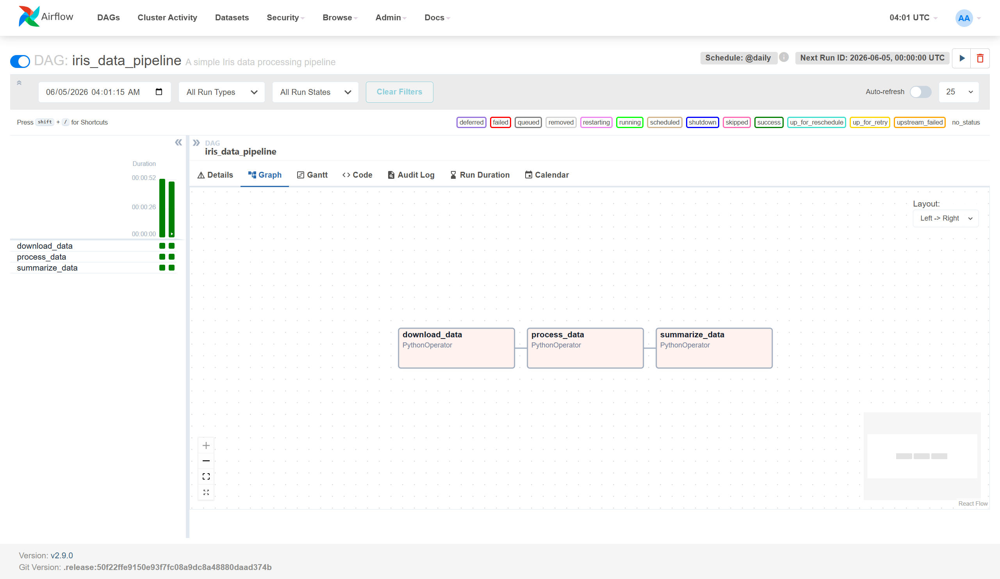

# airflow-data-pipeline
Apache Airflow DAG for a simple data processing pipeline

# Airflow Data Pipeline

A simple Apache Airflow DAG that downloads, processes, and summarizes the Iris dataset.

## Pipeline Steps
1. **download_data** - Downloads the Iris CSV dataset from GitHub
2. **process_data** - Filters rows where species is 'setosa'
3. **summarize_data** - Prints summary statistics of the filtered data

## Prerequisites
- Windows 10/11 with WSL2 (Ubuntu)
- Python 3.12+
- Git

## Setup Instructions

### 1. Clone the repository
git clone https://github.com/YOUR_USERNAME/airflow-data-pipeline.git
cd airflow-data-pipeline

### 2. Create and activate virtual environment
python3 -m venv airflow-env
source airflow-env/bin/activate

### 3. Install Apache Airflow
pip install apache-airflow==2.9.0 --constraint "https://raw.githubusercontent.com/apache/airflow/constraints-2.9.0/constraints-3.12.txt"

### 4. Initialize Airflow database
airflow db init

### 5. Create admin user
airflow users create --username admin --password admin123 --firstname Airflow --lastname Admin --role Admin --email admin@example.com

### 6. Update dags_folder in airflow.cfg
Edit ~/airflow/airflow.cfg and set:
dags_folder = /path/to/airflow-data-pipeline/dags

### 7. Start Airflow
In terminal 1:
airflow webserver --port 8080

In terminal 2:
airflow scheduler

### 8. Trigger the DAG
- Open http://localhost:8080
- Login with admin/admin123
- Enable and trigger iris_data_pipeline

## Screenshot

